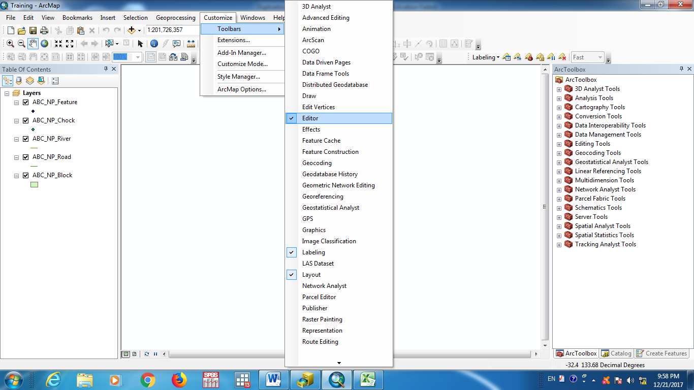

```{r setup, include=FALSE}
knitr::opts_chunk$set(echo = FALSE)
```


## 1. What do we need for digitization?

 => ArcMap,  ArcCatalog installed on Desktop/Laptop Computer with windows OS
 
## 1. What do we need for digitization?

 => Editor Tool ( Customize > Toolbars > Editor ) in ArcMap



## 1. What do we need for digitization?

 => Topology Tool ( Editor > More Editing Tools > Topology ) in ArcMap
 
## 1. What do we need for digitization?

 => Make  ABC_NP/MNP/UMNP .mxd file

 => Metropolitan/Sub Metropolitan/Municipality Shape file with WGS 1984 Geographic Coordinate system 

 => Internet Connection


## 2. How  to make File Geodatabase , Blank Shape files of Blocks, Chocks, Features,  Roads, Rivers with Attribute Table ?

i. Go to Catalog

ii. Make a folder (ABC_Digitization) in the drive (D: or E:)

iii. Right on the folder > New > File Geodatabase (Note: Name should be ABC_NP/MNP/UMNP.gdb)

iv. Rename File Geodatabase as ABC_NP

v. Right click on ABC_NP >New > Feature Class … >Name (ABC_NP_Block) > Next > 
Select GCS_WGS_1984>Next>Next>Next>New  Feature Class window will appear


## 3. How to do digitization (fill attributes in the shape files of Block, Chock, Feature, Road and River)  using  Esri Image?

i. Load Metropolitan/Sub-Metropolitan/Municipality Shape file
  
ii. Load Esri Image ( Go to Add > Add Data…  > Imagery  )

iii. Do correction on Ward Boundaries using topology tool

## 3. How to do digitization (fill attributes in the shape files of Block, Chock, Feature, Road and River)  using  Esri Image?

iv. Load Block/Chock/Feature/Road/River Shape file from file geo database

v. Go to Editor > Start editing > Select the shape file which you want to edit

vi. Go to Create Features > Click Over the shape file > Start digitization (Note: When you want  to move over  line you must use trace tool) > Attributes > Fill the attribute values
   


  


